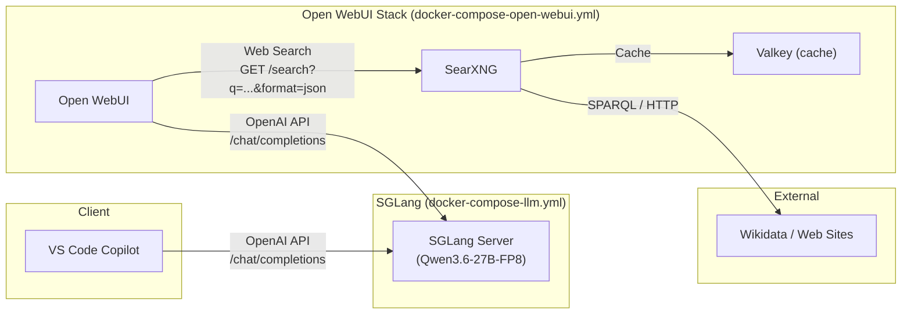

# What is it?

This project runs a local Qwen model on SGLang and exposes it in two ways:

- VS Code Copilot BYOK custom endpoint
- Open WebUI chat interface

It is built for multi-turn coding workflows with tool calling and long context.

## Architecture



| Component | Role |
|---|---|
| **VS Code Copilot** | External client, sends chat completions to SGLang |
| **SGLang Server** | Runs the Qwen model, exposes OpenAI-compatible API on port 8000 |
| **Open WebUI** | Chat UI, talks to SGLang for LLM calls and SearXNG for web search |
| **SearXNG** | Self-hosted metasearch engine, queries external sites |
| **Valkey** | In-memory cache backing SearXNG |

- SGLang server: `docker-compose-llm.yml`
- Open WebUI stack (plus SearXNG): `docker-compose-open-webui.yml`
- Restart utilities: `scripts/`

## Quick start

1. Configure `OPENAI_API_BASE_URL` in `docker-compose-open-webui.yml` to point at your SGLang host (default: `http://host.docker.internal:8000/v1` for same-box).

2. Start SGLang:

```bash
scripts/restart-sglang.sh up
```

3. Start Open WebUI:

```bash
scripts/restart-open-webui.sh up
```

4. Tail logs if needed:

```bash
docker logs -f sglang-qwen
docker logs -f open-webui
```

## Deployment examples

### Example 1: Single machine (SGLang + Open WebUI on one host)

```bash
# Default OPENAI_API_BASE_URL is already http://host.docker.internal:8000/v1
scripts/restart-stack.sh up
```

Access:

- Open WebUI: `http://<THIS_HOST_IP>:3000`
- SGLang API: `http://<THIS_HOST_IP>:8000/v1`

### Example 2: Two machines (Box A = SGLang, Box B = Open WebUI)

On Box A (GPU host):

```bash
scripts/restart-sglang.sh up
```

On Box B (UI host):

```bash
# Edit docker-compose-open-webui.yml and set:
#   OPENAI_API_BASE_URL=http://<BOX_A_IP>:8000/v1
scripts/restart-open-webui.sh up
```

## Access methods

### 1) VS Code Copilot BYOK

Use this valid `chatLanguageModels.json` content in your VS Code user config:

```json
[
	{
		"name": "My-Local-LLMs",
		"vendor": "customendpoint",
		"apiType": "chat-completions",
		"apiKey": "NOT-NEEDED",
		"models": [
			{
				"id": "Qwen/Qwen3.6-27B-FP8",
				"name": "Qwen 3.6 27B FP8",
				"url": "http://<SGLANG_HOST_OR_IP>:8000/v1/chat/completions",
				"toolCalling": true,
				"vision": false,
				"maxInputTokens": 229376,
				"maxOutputTokens": 32768,
				"apiKey": "NOT-NEEDED"
			}
		]
	}
]
```

### 2) Open WebUI

Open:

```text
http://<OPEN_WEBUI_HOST_OR_IP>:3000
```

Open WebUI sends model requests to `OPENAI_API_BASE_URL`.

## Utilities

- Restart only SGLang:

```bash
scripts/restart-sglang.sh
```

- Restart only Open WebUI stack:

```bash
scripts/restart-open-webui.sh
```

- Restart both:

```bash
scripts/restart-stack.sh
```

- Optional actions:

```bash
scripts/restart-sglang.sh --action up
scripts/restart-sglang.sh --action down
scripts/restart-open-webui.sh --action up
scripts/restart-open-webui.sh --action down
```

## Run on different boxes

You can split services across machines.

### Pattern A: Same box

- SGLang and Open WebUI run on one host.

```env
OPENAI_API_BASE_URL=http://host.docker.internal:8000/v1
```

### Pattern B: Different boxes

- Box A runs SGLang.
- Box B runs Open WebUI.

```env
OPENAI_API_BASE_URL=http://<BOX_A_IP>:8000/v1
```

Make sure Box B can reach Box A on port 8000.

### Remote restart over SSH

Run scripts against another host:

```bash
scripts/restart-sglang.sh --host user@box-a --remote-dir /path/to/sglang
scripts/restart-open-webui.sh --host user@box-b --remote-dir /path/to/sglang
scripts/restart-stack.sh --host user@box-a --remote-dir /path/to/sglang
```

## Notes

- Keep real IPs and keys out of git. Use placeholders in docs.
- If you do not use remote OpenAI auth, keep `OPENAI_API_KEY=EMPTY`.